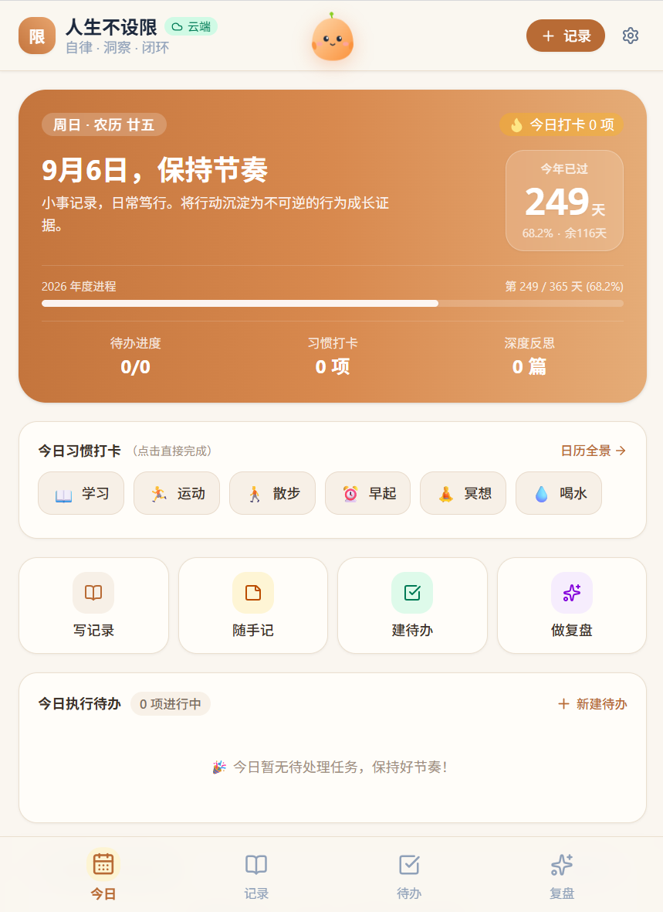
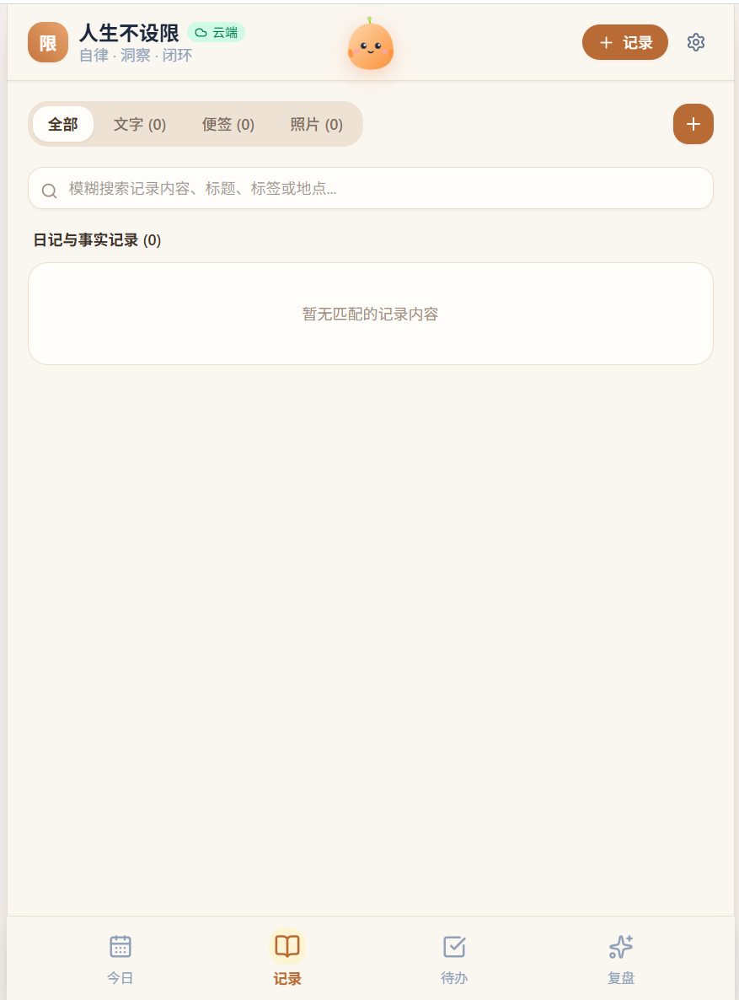
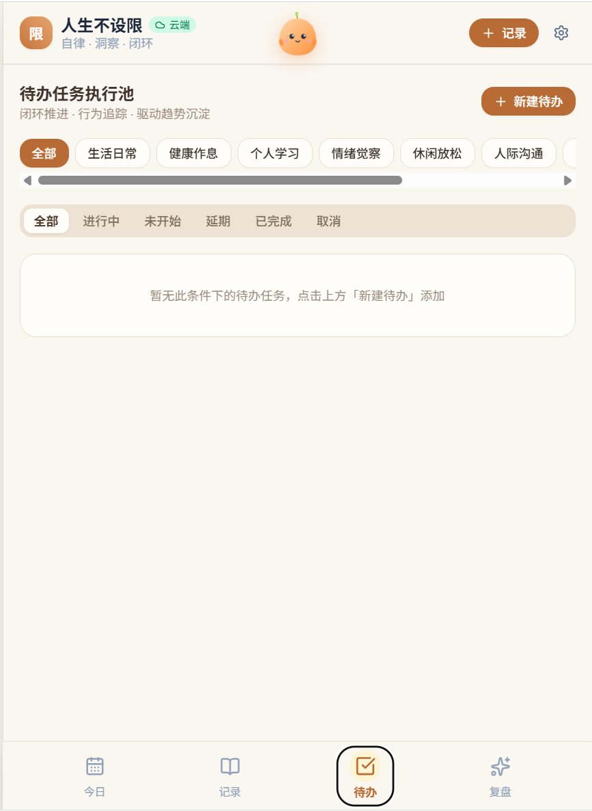
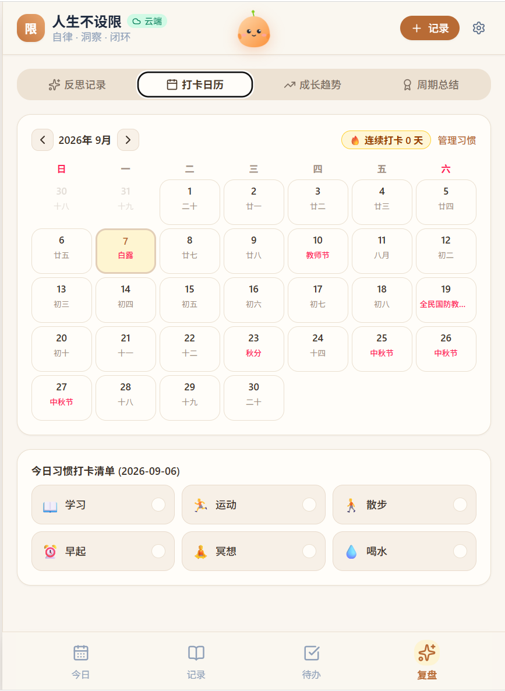

# AI 生活记录系统

一个**隐私优先**的个人生活记录 App：随手记录生活、打卡日历、任务管理、AI 反思与成长趋势分析。
本仓库为 **网页版**（React + TypeScript + Vite），可用 Capacitor 打包成 Android APK，也支持 PWA 安装到手机桌面。

> ⚠️ 数据默认只保存在**本机浏览器 / 手机本地**（localStorage），不上传任何服务器。
> 想云同步请自行搭建 Supabase（见下方说明），数据完全由你自己掌控。

## ✨ 功能

- 📝 **生活记录**：文字 + 照片，带定位、AI 摘要
- 🗓️ **打卡日历**：农历、中国节日、习惯打卡
- ✅ **任务管理**：分类、优先级、状态流转、AI 拆解步骤
- 🧠 **AI 反思**：对记录做结构化反思（不评价人格、不推断未写内容），支持周/月/年总结
- 📈 **成长趋势分析**：按分类聚合行为趋势与主题
- 🔒 **生物识别锁**：敏感反思可上锁
- ☁️ **可选 Supabase 同步**：不上云则纯本地运行
- 📸 **朋友圈式小记**：图文随记，随时记录生活碎片
- 📍 **位置记录**：拍照/记录可附带位置信息

## 📱 界面展示

依次为 App 的主要使用流程界面：

| | |
|---|---|
|  |  |
|  |  |

**这个 App 能做什么？** 一句话：它是一个**本地优先的个人生活助理**——

- 用「记录 + 打卡 + 任务」把生活数据化：随手写下发生的事、每天打卡习惯、管理要执行的任务；
- 用 **AI**（DeepSeek 等 OpenAI 兼容接口）把数据变成洞察：对记录做结构化反思、把大任务拆成可执行步骤、生成周/月/年度总结；
- 用「成长趋势分析」把时间变成曲线：看到自己在各分类下的行为是改善还是恶化，长期追踪行为变化；
- 数据主权归你：默认所有数据只存在本机，想云同步就接自己的 Supabase，无广告、无统计、无账号绑定。

## 🧱 技术栈

React 18 · TypeScript · Vite 5 · Tailwind CSS 4 · Capacitor 8（Android APK）· Supabase（可选同步）

## 🚀 本地运行

需要 Node.js ≥ 20。

```bash
npm install
npm run dev        # 开发模式，浏览器打开 http://localhost:3000
npm run build      # 构建生产产物到 dist/
```

### 打包 Android APK

```bash
npm install
npm run build
npx cap sync android
cd android && ./gradlew assembleDebug
# 产物：android/app/build/outputs/apk/debug/app-debug.apk
```

> 需要 Android SDK（compileSdk 36）+ JDK 21。也可以直接在 GitHub Actions 的
> **Actions → Build Android APK → 手动运行** 后从 Artifacts 下载。

## ☁️ 配置 Supabase 云同步（可选）

不配置则纯本地使用；配置后可把数据同步到自己建的 Supabase 项目，换设备不丢。

完整图文步骤见 **[docs/SETUP-SUPABASE.md](docs/SETUP-SUPABASE.md)**，简单说：

1. 到 [supabase.com](https://supabase.com) 注册并新建项目
2. 打开 **SQL Editor**，按顺序执行 `supabase/` 目录下的 SQL 文件（schema.sql → ext01 → ext04 → ext08 → ext09）
3. 记下 **Project Settings → API** 里的 `Project URL` 和 `anon public key`
4. 两种接入方式任选：
   - **App 内配置**（推荐，无需重新打包）：设置页 → Supabase 同步 → 填入 URL 与 Key → 测试连接 → 一键上传/拉取
   - **打包时预置**：把 `.env.example` 复制为 `.env`，填入 `VITE_SUPABASE_URL` / `VITE_SUPABASE_ANON_KEY` 后重新构建

## 🔑 配置 AI（DeepSeek 等）

AI 反思/摘要/任务拆解使用 OpenAI 兼容接口，默认 DeepSeek。在 App 设置页填入 API Key 即可；
也可以复制 `.env.example` 为 `.env` 后预置 `AI_API_KEY`（或 `VITE_AI_API_KEY`）再构建。

## 🏗️ 目录结构

```
src/
├── components/   # 页面组件（记录/日历/任务/反思/趋势/设置）
├── context/      # 全局状态
├── services/     # 存储(本地/Supabase)/AI/任务服务
├── utils/        # 校验/农历/检索等工具
└── growth/       # 成长趋势引擎
supabase/         # 数据库建表 SQL（schema + 扩展 + RLS 修复）
docs/             # 说明文档
android/          # Capacitor Android 工程
```

## ⚖️ License

[MIT](LICENSE)

---

*本项目为个人生活记录工具，AI 生成的反思与建议仅供参考，不构成任何医疗或心理建议。*
